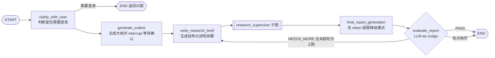
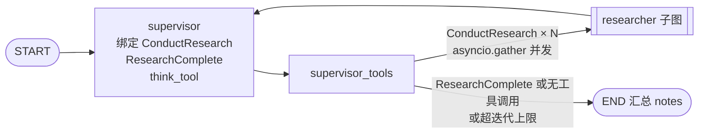
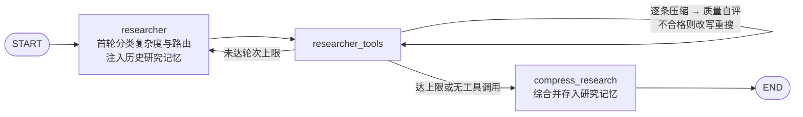
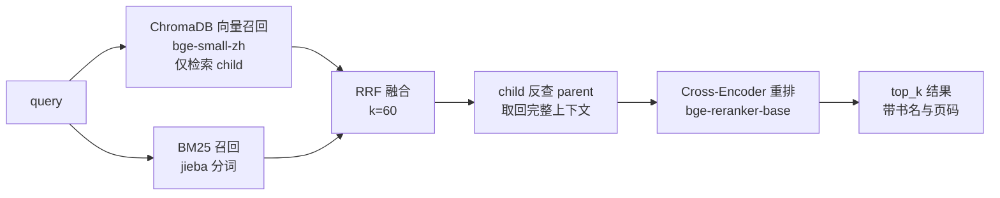

# My Deep Research Agent

基于 LangGraph 的深度研究 Agent。输入一个研究问题，自动完成任务拆解、并行检索（本地知识库 + Web）、上下文压缩、报告生成与质量自评，输出带来源引用的结构化研究报告。

三层图编排（主流程 / Supervisor / Researcher）+ 双路混合检索（向量 + BM25 → RRF → Cross-Encoder 重排）+ MCP 服务化，可 Docker 一键部署。

---

## 出处与分工

本项目以 LangChain 的 [open_deep_research](https://github.com/langchain-ai/open_deep_research)（MIT License）为起点。

**沿用上游的部分**：Multi-Agent 编排骨架 —— `supervisor` / `researcher` / `compress_research` / `final_report_generation` 等节点，`ConductResearch` / `ResearchComplete` / `think_tool` 工具契约，以及对应的 prompt。

**本项目自研的部分**：

| 模块 | 内容 | 代码位置 |
|------|------|---------|
| **本地知识库混合检索** | PDF 解析、语义分块、Parent-Child 分块、ChromaDB + BM25 双路召回、RRF 融合、Cross-Encoder 重排、增量索引 | `knowledge_base.py` |
| **LinUCB 自适应路由** | 手写 Contextual Bandit（NumPy），按查询特征在 local / web / both 之间学习路由策略 | `bandit.py` |
| **MCP 双模式** | 知识库检索可作为标准 MCP 服务暴露；Agent 支持 `direct` / `mcp` 切换，且拒绝静默降级 | `mcp_server.py`、`utils.py` |
| **Adaptive / Corrective RAG** | 查询复杂度分类 → 动态迭代预算；检索质量自评 → 查询改写重搜 | `deep_researcher.py` |
| **研究记忆** | 跨研究的记忆存储、LLM 合并、分层摘要、时间衰减排序 | `memory.py` |
| **上下文压缩与轨迹指标** | 逐条搜索结果压缩；搜索轮次 / 工具调用 / 改写次数 / 强制停止统计 | `deep_researcher.py` |

---

## 架构

### 主流程



`generate_outline` 用 LangGraph `interrupt()` 实现 Human-in-the-Loop：大纲返回前端，用户确认或修改后再 `Command(resume=...)` 继续。

### Supervisor 子图



超出 `max_concurrent_research_units` 的 `ConductResearch` 调用不排队，直接返回错误 ToolMessage 让模型重新规划 —— 与其悄悄丢弃或无限排队，不如让模型知道自己越界了。

### Researcher 子图



每个 researcher 的搜索轮次上限由首轮分类出的复杂度决定：`simple` 2 轮 / `medium` 3 轮 / `complex` 4 轮。分类只在首轮调用一次，结果缓存进 state。

### 本地知识库检索链路



---

## 核心机制与设计取舍

每一项都写清「怎么做的 / 为什么这么选 / 代价是什么」。

### 混合检索：为什么是 RRF，而不是分数加权

向量召回覆盖语义相近但用词不同的内容；BM25 覆盖精确术语 —— `ENTRYPOINT`、`veth pair` 这类词向量模型容易糊掉。两路都要。

问题在于怎么合。BM25 分数是 0～30 量级的无界值，向量 distance 是 0～1 且**越小越相似**；要加权就必须先回答两个没有标准答案的问题：怎么归一化，以及只出现在单路召回里的候选另一路给多少分。RRF 只用排名不用分数，这两个问题自然消失。

**代价**：丢掉了分数携带的置信度信息 —— 「排第一但分数很低」和「排第一且分数很高」在 RRF 里等价。

**验证方式**：`probes/probe_fusion_diff.py` 实测了 RRF 与「逐 query min-max 归一化 + 加权」两种方案的 top-k 重合度和平均名次位移。思路是**先测差异，再测优劣**：如果两者结果几乎重合，就不必为"谁更好"去建标注集。

### Parent-Child 分块：匹配粒度与上下文粒度解耦

先按句号切 2000 字的 parent，再对每个 parent 做语义分块得到 512 字的 child。索引和召回都在 child 上做，命中后通过 `parent_id` 反查 parent 全文喂给 LLM。

**为什么**：512 字的 chunk 让向量匹配足够精确，但单独拿出来常常缺少上下文（代词指向不明、前提条件在上一段）。2000 字的 parent 补上这一层。

**代价**：存储翻倍；RRF 融合发生在 child 粒度而 Cross-Encoder 重排发生在 parent 粒度，两级排序的输入不是同一个东西。

### 语义分块 + 长度兜底

用 `SemanticChunker`（percentile 断点）按语义边界切，再对超过 512 字的块按句号二次切分。跨页文本先按书拼接、插入 `[PAGE:n]` 标记，切完再抽取页码并清理标记 —— 这样跨页的句子不会被页边界斩断，同时页码元数据得以保留（引用要用）。

**代价**：语义分块要跑 embedding 模型，几本技术书首次建索引约 30 分钟。

### Adaptive RAG：按复杂度分配迭代预算

首轮用一次 LLM 调用同时输出复杂度和数据源建议（`complex | both` 格式），结果缓存到 state，后续轮次直接读，不重复调用。

**代价**：分类本身要花一次 LLM 调用。对 `simple` 查询省下的 1～2 轮搜索通常划得来；对 `complex` 查询是净开销。

### Corrective RAG：检索质量自评与改写重搜

搜索结果经 LLM 逐条判定相关性，不相关占比 > 50% 时改写查询重搜一次 —— 只重试一次，不递归。改写只替换工具参数里的 `queries` 字段，其余参数原样保留，`think_tool` 等非搜索工具的结果不动。

**代价**：判定和改写各是一次额外 LLM 调用。当前判定逻辑依赖对 LLM 自由文本做关键词计数，不够稳，见 [ROADMAP](ROADMAP.md)。

### 上下文压缩

对每条搜索结果单独调 LLM 提取与主题相关的部分，去掉广告和导航。短文本（< 200 字）跳过，LLM 失败降级返回原文。

**代价**：省了下游 token，但压缩本身是 N 次额外 LLM 调用。净收益尚未量化。

### LinUCB 自适应路由：为什么手写

手写 LinUCB（NumPy，约 100 行）：3 个动作（local / web / both），3 维特征（复杂度分值、本地关键词命中、query 长度归一化）。前 10 次研究用 LLM 路由冷启动，之后切 LinUCB；模型参数持久化到 `bandit_model.json`，重启不丢。奖励信号取自报告质量自评的 `PASS` / `NEEDS_MORE` 判定。

**为什么不引库**：只有 3 动作 3 特征，引入 bandit 框架的收益低于把算法本身讲清楚的收益。`select_action` 里 `predicted + alpha * sqrt(xᵀA⁻¹x)` 一行就对应到 UCB 的置信上界 —— 这个动作的数据越少，`A⁻¹` 越大，探索加成越高。

**代价与现状**：3 维特征偏薄，`local_relevance` 靠硬编码关键词表，加新书要改代码。奖励回填链路目前尚未打通（LangGraph 子图 state 未透传到主图），正在修复 —— 详见 [ROADMAP](ROADMAP.md) 与下一节。

### MCP 双模式：拒绝静默降级

同一份检索实现既能进程内调用（`direct`），也能作为标准 MCP 服务暴露（`mcp`，FastMCP + Streamable HTTP）。两种模式下工具名、描述、参数 schema 完全一致 —— **对模型而言不可区分**，否则切换模式就等于换了个 prompt。这一点由 `tests/test_kb_mode_parity.py` 断言，而不是靠约定。

MCP 服务未启动时 `kb_mode=mcp` 抛 `MCPUnreachableError` 并提示启动方式，**不静默退回 `direct`**。原因见下一节。

---

## 静默失效：这个项目真正花时间的地方

上面的功能列表看起来是"加了 N 个 RAG 变体"。实际上大部分时间花在另一类问题上：**日志正常、流程正常、指标正常，只有效果不对。**

这类 bug 没有 traceback，测试不覆盖，靠读代码也很难看出来。以下四个是同一类问题的不同形态。

### 1. 改写重搜用的还是原始查询（已修，`07ff22b`）

Corrective RAG 判定检索质量不合格 → 调 LLM 改写查询 → 重搜。日志里能看到"改写查询：A → B"，能看到"改写重搜完成"，轨迹指标里 `rewrite_count` 也在正常递增。

但重搜时传给工具的 `args` 还是原来那个 —— **改写结果算出来了，没用上。** 整条 Corrective RAG 链路在跑，效果等于没开。

修完之后把重试逻辑抽成独立函数 `_retry_with_rewritten_query`，用 `tests/test_rewrite_args.py` 四个断言钉住：改写后的 query 真的到了搜索工具、非搜索工具不被重跑、`queries` 之外的参数保留、结果与 `tool_calls` 顺序一一对应。这四条都不依赖网络和 LLM，任何时候都能跑。

### 2. BM25 缓存与 ChromaDB 失去同步（已修，`78ca056`）

BM25 索引（pickle 缓存）和 ChromaDB 是两套独立存储。如果只有一套被重建 —— 比如删了 `chroma_db/` 但缓存还在 —— 向量检索会**静默返回空结果**，"混合检索"退化成纯 BM25。检索仍有结果返回，日志无异常，只是少了一路。

现在 `build_index` 在加载缓存后校验两者条目数，不一致直接抛 `RuntimeError`，并在错误信息里写明修复方式和代价（删缓存重建，约 30 分钟）。

**选择 fail loudly 而不是自动修复**：自动重建 30 分钟会让调用方以为程序卡死；而"能跑但少一路召回"是最坏的状态 —— 它不会让你去查。同样的理由，`kb_mode=mcp` 连不上服务时也宁可报错，不退回 `direct`。

### 3. 缓存的 ChromaDB collection 成了悬挂引用（已修，`ef9b7e6`）

`get_or_create_collection` 只要 0.34ms，本来不值得缓存。但缓存了之后，全量重建流程里的 `delete_collection` 会让那个模块级变量指向一个已经不存在的 collection —— 后续写入落到虚空里。

结论是：**缓存的代价不是内存，是失效时机。** 现在只缓存 client 和 embedding function，collection 每次取。

### 4. Command 路由的声明与实现不一致（已修，`0c22bf9` / `03b2911`）

两个 bug，一次调查。

`clarify_with_user` 用 `Command(goto=...)` 路由，却同时声明了一条静态边 `add_edge("clarify_with_user", "generate_outline")`。隔离实测：**即使节点返回 `Command(goto=END)`，静态边的目标依然执行，图不会终止。** 于是用户提了个模糊问题、本该收到澄清，实际收到的是基于未澄清问题生成的大纲确认 —— 澄清环节形同虚设。（只在 `allow_clarification=True` 时触发；web 入口硬设为 `False`，所以 UI 不受影响。）

顺着查下去发现更大的问题：`generate_outline` 和 `evaluate_report` 也用 `Command` 路由，但**没有返回类型标注**。`get_graph()` 从 `START` 做可达性遍历，把没有标注的 `Command` 节点当成死胡同接到 `END` 并停止 —— 7 个节点里 4 个悬空，连显式写的 `add_edge` 都从图里消失，其中包括多轮补充研究那个循环 `evaluate_report → write_research_brief`。运行时不受影响，坏掉的是所有 `get_graph()` 的消费方：Studio、`draw_mermaid()`、任何对图的静态检查。

两个实测发现（都记在测试的 docstring 里）：

- `compile()` 只校验 `Literal` 里的目标是**已注册的节点**，不校验这个节点真的会跳过去。所以标注**写不全比不写更危险** —— 不写的图明显是断的，写错的图会画出一条永远走不到的假边、同时隐藏真实路径。运行时两种都不管。
- `get_graph()` 把「静态边」和「`Command` 边」指向同一目标的情况**合并成一条无法区分的边**。所以"多了一条静态边"这个回归**在编译后的图上是隐形的** —— 只能查 `builder.edges`。

`tests/test_graph_wiring.py` 用三个断言钉住这三种失效，每个都通过重新引入对应缺陷验证过会红。探针见 [`probes/`](probes/)。

### 5. LinUCB 的奖励一直打在同一个动作上（进行中）

`evaluate_report` 从 `AgentState` 读 `query_complexity` / `source_routing` 来决定奖励更新哪个动作。但这两个字段只存在于 researcher 子图的 `ResearcherState`，没有通过 `ResearcherOutputState` 透传回主图 —— `state.get()` 每次都拿到默认值，于是奖励永远落在 `both` 上，`local` / `web` 两个动作的参数矩阵保持初始值。

外部看不出任何异常：`bandit_model.json` 在正常更新、`total_updates` 在正常递增、路由决策也在正常产出。**唯一的症状是学不到东西。**

这是同一类问题的第五个形态：**子图状态隔离带来的静默数据丢失。** 修法和排期见 [ROADMAP](ROADMAP.md)。

---

## 检索评估方法论

检索链路的每个设计决策都能被追问一句「你怎么知道这样更好」。这一节写清评估用什么指标、为什么这么选，以及怎么避免评测集本身把结论带偏。

### 为什么不能只算 MRR / NDCG

`evaluation.py` 实现了 MRR / Precision@K / NDCG，相关性标签由 LLM 对**已召回文档**逐条打 0/1/2 分。

这套指标只能衡量"返回结果的排序好不好"，**算不出 Recall** —— 库里有答案却没被召回的情况，它完全看不见。而混合检索要证明的恰恰是"比单路召回得更全"。所以这条路走不通，必须有带标准答案的查询集。

### 为什么先建探针，再建标注集

建一个可信的标注集要人工审阅，成本不低。所以先用两个不需要标注的探针确认"有没有必要标"：

- **`probes/probe_score_scales.py`** — 量化两路召回的分数量纲差异，以及 parent 块对 BM25 召回名额的挤占程度（向量路有 `type=child` 过滤，BM25 路没有，两路口径不一致，parent 在全库占 19.2%）。
- **`probes/probe_fusion_diff.py`** — 对比 RRF 与 min-max 加权两种融合的 top-k 重合度、第一名是否相同、平均名次位移。**如果两者的 top-5 几乎重合，就没必要为"谁更好"去建标注集。**

两个探针都用同一组三类查询（关键词型 / 概念型 / 库外型），覆盖两路各自的强弱以及"库里没有答案"的行为。

### 查询集怎么生成，以及它的已知偏差

`eval/make_queryset.py` 随机抽 child chunk，让 LLM 为每段反推一个"这段能回答的问题"。chunk 自带 source/page 元数据，因此 (问题, 页码) 天然成对，不需要人工翻书对答案。固定随机种子保证可复现，并额外加入三条明确不在知识库范围内的查询，用于测「库里没有答案时的行为」。

**已知偏差**：LLM 反推问题时倾向复用原文措辞，生成的查询偏"字面匹配型"，会**系统性高估 BM25、低估向量检索**。prompt 里已要求改写措辞但无法消除 —— 因此脚本输出被明确定义为**草稿**，`reviewed` 字段默认 `false`，需人工逐条审阅、改写或剔除后才能作为评测集使用。

### 下一步

在人工审阅后的查询集上跑「纯向量 / 纯 BM25 / RRF 混合 / 混合 + 重排」四档对比，算 Recall@k 与 MRR，并用同一集合交叉验证 `probes/probe_fusion_diff.py` 的结论。

---

## 快速开始

### 方式一：Docker（推荐）

只需安装 [Docker](https://docs.docker.com/get-docker/)，不需要 Python 环境。

```bash
git clone <repo-url>
cd my_deep_research_2
cp .env.example .env
```

编辑 `.env`：

```env
DEEPSEEK_API_KEY=your_deepseek_api_key
TAVILY_API_KEY=your_tavily_api_key        # 可选，默认用 DuckDuckGo
LANGSMITH_API_KEY=your_langsmith_api_key  # 可选，用于追踪调试
```

把 PDF 放入 `knowledge_base/`（可选），然后：

```bash
docker compose up --build                  # CPU 版
docker compose --profile gpu up --build     # GPU 版，需 nvidia-container-toolkit
```

浏览器打开 http://localhost:8000

```bash
docker compose ps          # 状态
docker compose logs -f     # 日志
docker compose down        # 停止
```

> **首次建索引约 30 分钟**（语义分块要跑 embedding 模型），日志会持续输出，不是卡死。
>
> **当前限制**：`docker-compose.yml` 挂载了 `knowledge_base/` 和 `chroma_db/`，但 BM25 缓存 `bm25_cache.pkl` 未挂载。容器重建后 BM25 索引丢失、ChromaDB 仍在，会触发上文提到的一致性校验报错；此时删掉 `chroma_db/` 重建即可。补一条卷映射就能解决，见 [ROADMAP](ROADMAP.md)。

### 方式二：本地开发

需要 Python >= 3.11 和 [uv](https://docs.astral.sh/uv/)。

```bash
git clone <repo-url>
cd my_deep_research_2
uv sync
cp .env.example .env      # 填入 API Key

uv run uvicorn web.server:app --host 0.0.0.0 --port 8000
```

也可以直接用 LangGraph Studio 打开项目（已含 `langgraph.json`）。

### 运行测试

```bash
uv run pytest tests/ -v
```

- `test_rewrite_args.py` —— 不依赖网络和 LLM，任何时候都能跑
- `test_graph_wiring.py` —— 同样无外部依赖；首次导入会拉起 torch，约十几秒
- `test_kb_mode_parity.py` —— 需要 MCP 服务在线；未启动时 **skip 并打印原因和启动命令**，不静默通过

尚未接 CI。

---

## MCP 知识库服务

```bash
python -m my_deep_research.mcp_server
```

默认监听 `http://127.0.0.1:8000/mcp`（Streamable HTTP）。

> ⚠️ MCP 服务与 Web 服务默认都用 8000 端口，同时跑需要错开，例如把 Web 服务挪到 8080：
> ```bash
> uv run uvicorn web.server:app --port 8080
> ```

用 [MCP Inspector](https://github.com/modelcontextprotocol/inspector) 验证：

```bash
npx -y @modelcontextprotocol/inspector
```

Transport 选 **Streamable HTTP**，URL 填 `http://127.0.0.1:8000/mcp`，连接后可在 Tools 面板看到并调用 `local_knowledge_search`。

让 Agent 自身走 MCP 模式：把配置项 `kb_mode` 设为 `mcp`。

---

## 配置项

| 配置项 | 默认值 | 说明 |
|--------|--------|------|
| `research_model` | `deepseek-chat` | 主流程模型（澄清 / 大纲 / 纲要 / Supervisor / 报告 / 质量自评） |
| `compression_model` | `deepseek-chat` | 辅助任务模型（上下文压缩 / 复杂度分类 / 检索质量评估 / 查询改写 / 记忆合并） |
| `summarization_model` | `deepseek-chat` | Tavily 网页摘要 |
| `final_report_model` | `deepseek-chat` | 最终报告，`max_tokens` 16384 |
| `search_api` | `duckduckgo` | `tavily` / `duckduckgo` / `none` |
| `max_search_results` | `5` | 每个 query 返回的结果数 |
| `max_content_length` | `50000` | 送去摘要的网页内容字符上限 |
| `max_concurrent_research_units` | `3` | Supervisor 单轮并发派发的 researcher 上限；超出的调用直接返回错误，不排队 |
| `max_supervisor_iterations` | `5` | Supervisor 循环硬上限 |
| `max_research_loops` | `2` | 报告被判 `NEEDS_MORE` 后的补充研究轮次上限 |
| `allow_clarification` | `true` | 是否允许研究前反问澄清 |
| `embedding_model` | `BAAI/bge-small-zh-v1.5` | 向量嵌入模型，语义分块与检索共用 |
| `knowledge_base_description` | 见代码 | 供路由分类判断「这个主题本地库有没有覆盖」 |
| `kb_mode` | `direct` | `direct` 进程内 / `mcp` 走 MCP 服务 |
| `mcp_kb_url` | `http://127.0.0.1:8000/mcp` | MCP 知识库服务地址 |

所有配置支持环境变量覆盖（大写形式，如 `RESEARCH_MODEL`）。优先级：**环境变量 > `RunnableConfig.configurable` > 字段默认值**。

**两个需要注意的语义**：

- `max_researcher_iterations`（默认 5）**只被写进 Supervisor 的 prompt 文本**，是给模型的软约束，不是代码硬限制。单个 researcher 的实际轮次上限由复杂度分类决定（simple 2 / medium 3 / complex 4），硬编码在 `researcher_tools`。Web 界面把它做成了可调控件，但调它只改 prompt 文本 —— 名不副实，待修。
- `max_react_tool_calls`（默认 18）是一道独立于轮次上限的**兜底**防线，卡的是工具调用**总数**而不是轮次——一轮里 LLM 可能并行发起多个工具调用，轮次没到但调用总数异常时，轮次那道防线管不住，这道线才顶上。默认值按 `complex` 档正常预估（4 轮 × 每轮 3 个工具调用 = 12）留出 1.5 倍余量定的，避免它在正常情况下比轮次上限先触发，变成事实上的主限制。

---

## 项目结构

```
src/my_deep_research/
├── deep_researcher.py   # LangGraph 主流程：三层图、Adaptive/Corrective RAG、上下文压缩、报告自评
├── state.py             # 状态定义与 override_reducer
├── configuration.py     # 配置管理（环境变量 > configurable > 默认值）
├── prompts.py           # 全部 Prompt 模板
├── utils.py             # 搜索工具、工具装配、token 计算、ChromaDB/embedding 单例
├── knowledge_base.py    # PDF 解析、语义分块、Parent-Child、双路召回、RRF、重排、增量索引
├── mcp_server.py        # MCP 服务端（FastMCP，暴露 local_knowledge_search）
├── memory.py            # 研究记忆：存储、LLM 合并、分层摘要、时间衰减检索
├── evaluation.py        # 检索排序指标（MRR / Precision@K / NDCG）
└── bandit.py            # LinUCB Contextual Bandit

web/
├── server.py            # FastAPI：SSE 流式推进、大纲确认、追问、会话历史
└── index.html           # 前端界面

tests/
├── test_rewrite_args.py      # 改写重搜的参数替换（无网络依赖）
├── test_graph_wiring.py      # Command 路由声明与图边集一致（无网络依赖）
└── test_kb_mode_parity.py    # direct / mcp 工具契约一致性（需 MCP 服务）

eval/
└── make_queryset.py     # 检索评测查询集草稿生成器

probes/                  # 测量脚本，不是测试 —— 见 probes/README.md
├── probe_score_scales.py        # 两路召回的分数量纲与 parent 挤占
├── probe_fusion_diff.py         # RRF vs min-max 加权的结果差异
├── probe_command_vs_edge.py     # 静态边与 Command(goto) 并存时谁生效
├── probe_graph_reachability.py  # 缺标注是否截断 get_graph() 的遍历
├── probe_incomplete_literal.py  # Literal 漏列目标的后果
└── probe_dedup.py               # get_graph() 是否合并静态边与 Command 边
```

---

## 技术栈

| 层 | 选型 |
|----|------|
| Agent 框架 | LangGraph（StateGraph、子图、`interrupt`、`MemorySaver`、`astream_events`） |
| LLM | DeepSeek（默认），可切 OpenAI / Anthropic / Google |
| 向量库 | ChromaDB（PersistentClient） |
| 嵌入 | BAAI/bge-small-zh-v1.5（ModelScope 下载） |
| 关键词检索 | rank-bm25（BM25Okapi）+ jieba |
| 重排 | BAAI/bge-reranker-base（sentence-transformers CrossEncoder） |
| 分块 | langchain-experimental SemanticChunker（percentile）+ 长度兜底 |
| PDF | PyMuPDF |
| 自适应路由 | 手写 LinUCB（NumPy） |
| Web 搜索 | DuckDuckGo（默认，免费）/ Tavily |
| 工具协议 | MCP —— 服务端 FastMCP，客户端 langchain-mcp-adapters |
| Web | FastAPI + SSE + 原生 HTML |
| 部署 | Docker / docker-compose（CPU 与 GPU 双 profile） |

---

## License

MIT
